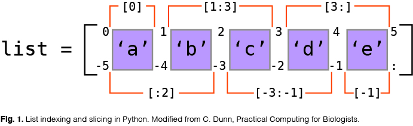

## Fall 2021 DASC Python Bootcamp

### Day 1: Python

We'll use [Google Colab](https://colab.research.google.com/) to run Python code inside of Jupyter notebooks

You'll need to clone this GitHub repository. It will help to copy and paste this web address:

	https://github.com/andrewalverson/F2021_python_bootcamp

We'll cover the following basic concepts and operations in Python:
	
- variables

- integers, floats, and strings

- basic math, adding numbers and strings

- how to build, use, slice, and index lists

<figure align = "center">

</figure>

- how to open, read, and parse a file
	
	- with open() as:

	- for loops

	- next()

- conditionals (if, elif, else)

- how to format and print output
	
	- f'' vs. print()
	
	- '+' vs. ','

- how to use Google to find help

### Day 2: R
